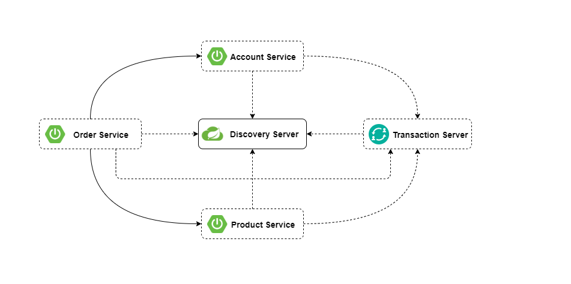
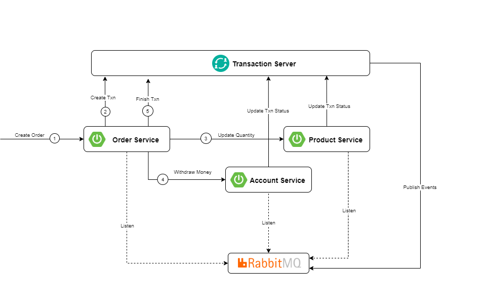

# Distributed Transactions in Microservices Using 2-Phase Commit (2PC)

The services in this project are designed with microservice architecture for performing distributed transaction using 2-Phase Commit (2PC).

Each microservice exposes REST API interfaces that can be accessed through OpenAPI endpoint (/swagger-ui.html)

## Tech Stack
 1. SpringBoot
 2. Spring Data JPA
 3. MySQL Database
 4. RabbitMQ

## Pre-Requisites
 1. RabbitMQ
    - Start RabbitMQ in Docker with command `docker run -d --hostname my-rabbit --name some-rabbit -p 8080:15672 rabbitmq:3-management` [Learn more](https://hub.docker.com/_/rabbitmq)
 2. MySQL Database
    - Start MySQL in Docker with command `docker run --name some-mysql -e MYSQL_ROOT_PASSWORD=my-secret-pw -d mysql:tag` [Learn more](https://hub.docker.com/_/mysql)

## Usage
 1. Start `discovery-server`. Default port is 8761.
 2. Start all microservices: `transaction-server`, `account-service`, `order-service`, `product-service`
 3. Add some test data to `account-service` and `product-service`
 4. Send order creation request to `order-service` for testing the flow.

 ## Architecture

 In this microservice-based architecture `discovery-server` plays an important role for registering and retrieving the service instances from a centralize location.
 
 The `transaction-server` is responsible for maintaining transaction status for multiple services for a given transactionId.

 There are three applications: `order-service`, `account-service` and `product-service`.
 
 The application `order-service` is communicating with `account-service` and `product-service`. All these applications are using MySQL database as a backend store.

## Distributed Transaction Flow

